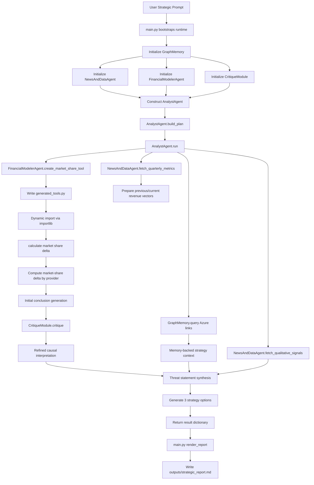

# Autonomous Strategic Analysis of Google Cloud

## 1. Purpose and Scope

This project implements a deterministic, offline-capable, multi-agent strategic analysis workflow.
It is designed to simulate how an executive-grade analysis assistant can:

1. Ingest cloud financial and qualitative signals.
2. Decompose a strategic prompt into execution steps.
3. Delegate subtasks across specialized agents.
4. Dynamically create and execute a financial modeling tool.
5. Self-critique shallow conclusions.
6. Produce an actionable strategy report for Microsoft in response to Google Cloud momentum.

The current implementation intentionally uses local sample data rather than live APIs so results are reproducible and easy to validate.

## 2. Business Question Solved

Core command implemented by the system:

Analyze Alphabet's latest quarterly earnings, focus on Google Cloud, identify the strongest strategic threat to Microsoft Azure, and generate three mitigation strategies.

## 3. System Design

### 3.1 Agent Roles

1. AnalystAgent
   - Owns orchestration logic.
   - Builds an execution plan.
   - Calls subordinate agents.
   - Fuses outputs into threat statement and strategy set.

2. NewsAndDataAgent
   - Reads structured KPI data from sample_inputs/quarterly_cloud_metrics.json.
   - Reads qualitative commentary from sample_inputs/qualitative_signals.json.

3. FinancialModelerAgent
   - Dynamically writes generated_tools.py at runtime.
   - Loads function calculate_market_share_delta via importlib.
   - Computes sequential market share delta for Google, Azure, AWS.

4. CritiqueModule
   - Detects superficial statements such as only reporting market-share movement.
   - Forces a causal layer: why shifts happen and what strategic response requires.

5. GraphMemory
   - Stores and queries strategic relationship edges.
   - Injects historical context into recommendation quality.

### 3.2 Why This Architecture

This decomposition mirrors real enterprise analysis:

1. Data collection is separate from interpretation.
2. Financial math is separated into explicit tools for traceability.
3. Critique ensures quality control and reduces weak summaries.
4. Memory reduces stateless analysis and keeps strategic continuity.

## 4. End-to-End Runtime Flow

Rendered flow image:

## 5. File-Level Deep Dive

### 5.1 main.py

Responsibilities:

1. Sets project base path.
2. Seeds graph memory with key strategic links.
3. Instantiates all agents/modules.
4. Runs the full analysis pipeline.
5. Renders and writes final markdown report.

Key function: render_report(result)

1. Extracts current quarter metrics.
2. Formats strategy actions into markdown table rows.
3. Adds critique output and memory context.
4. Produces final executive-ready markdown artifact.

### 5.2 agents.py

Contains all agent/module classes:

1. GraphMemory
   - add_edge(source, relation, target)
   - query(source=None, relation=None)

2. NewsAndDataAgent
   - fetch_quarterly_metrics()
   - fetch_qualitative_signals()

3. FinancialModelerAgent
   - create_market_share_tool()
   - Writes generated_tools.py and loads callable dynamically.

4. CritiqueModule
   - critique(initial_conclusion)
   - Returns advisory string indicating depth quality.

5. AnalystAgent
   - build_plan()
   - run(): executes complete strategic logic and synthesis.

### 5.3 sample_inputs/quarterly_cloud_metrics.json

Provides two periods for each provider:

1. Current quarter KPI set.
2. Previous quarter KPI set.

Metrics included:

1. revenue_billion
2. yoy_growth_percent
3. qoq_growth_percent
4. operating_income_billion
5. operating_margin_percent

These values are sufficient for trend analysis and market-share delta math.

### 5.4 sample_inputs/qualitative_signals.json

Contains commentary-like textual signals by source category:

1. earnings_call
2. analyst_note
3. market_commentary
4. benchmark_discussion

These signals are used to add causal interpretation beyond raw KPI numbers.

### 5.5 generated_tools.py

Created at runtime by FinancialModelerAgent.

Contains function:

calculate_market_share_delta(previous_revenue, current_revenue)

It computes:

1. Total market size for previous and current periods.
2. Provider share in each period.
3. Delta in percentage points per provider.

### 5.6 outputs/strategic_report.md

Final output artifact generated each run.

Includes:

1. Executive summary.
2. KPI snapshot.
3. Market-share delta.
4. Critique feedback.
5. Threat statement.
6. Three mitigation strategies.
7. Execution trace.

## 6. Dynamic Tooling Mechanics

The runtime tool-generation pattern is intentional and valuable for agentic systems:

1. Analyst requests a quantitative operation.
2. FinancialModeler creates specialized function code.
3. Tool is loaded dynamically.
4. Analyst uses generated callable in the same run.

Benefits:

1. Improves modularity of reasoning and computation.
2. Makes math logic explicit and inspectable.
3. Enables future extension to many generated tools.

Risks and constraints in production:

1. Must sandbox code execution.
2. Must validate generated code signatures and behavior.
3. Must apply strict security controls for untrusted tool generation.

## 7. Critique Loop and Quality Control

The critique stage catches shallow strategic statements.

Example pattern:

1. Initial statement: Google is growing share faster.
2. Critique: This is only what changed, not why.
3. Refinement: Explain AI-native product pull, data gravity, developer preference, and enterprise integration effects.

This raises output quality from dashboard commentary to strategic guidance.

## 8. Memory Usage and Strategic Continuity

Current seeded edge:

Microsoft Azure --[StronglyLinkedTo]--> Office365/EnterpriseSales

How memory improves decisions:

1. Prevents recommendations from ignoring known strengths.
2. Supports moat-oriented strategies instead of generic reactions.
3. Preserves institutional strategic context across runs.

## 9. Data Lineage: Where sample_inputs came from

Important clarification:

1. sample_inputs are synthetic demonstration data created for this project.
2. They are not pulled directly from live SEC filings, earnings APIs, or premium analyst terminals.
3. The structure and directional patterns are based on publicly discussed cloud-market behavior:
   - Google Cloud AI-led acceleration narrative.
   - Azure enterprise strength.
   - AWS scale and margin profile.

Why synthetic data is used here:

1. Deterministic output for local reproducibility.
2. No external API keys required.
3. Simplifies debugging and understanding agent flow.

## 10. Assumptions in this Implementation

1. Revenue comparability assumption
   - Revenue values are treated as comparable cloud-segment proxies for sequential share math.

2. Time consistency assumption
   - Current and previous periods are assumed aligned across providers.

3. Signal reliability assumption
   - Qualitative source summaries are treated as valid directional evidence.

4. Causality simplification assumption
   - Signals are interpreted for strategic causality without full econometric modeling.

5. Strategy feasibility assumption
   - Strategy costs and outcomes are directional, not budget-authorized plans.

## 11. How to Run

From this folder:

python main.py

Expected console output:

1. Analysis complete.
2. Report path location.

## 12. Validation Checklist

After each run verify:

1. generated_tools.py exists.
2. outputs/strategic_report.md is regenerated.
3. Market-share deltas are numeric and plausible.
4. Critique section is present.
5. Strategy table has three entries.

## 13. Extending to Production

Recommended upgrades:

1. Replace sample inputs with live connectors:
   - SEC filings parser.
   - Earnings transcript ingestion.
   - Financial KPI APIs.

2. Add schema validation:
   - Pydantic or JSON schema checks for all inputs.

3. Add observability:
   - Structured logs.
   - Step timings.
   - Trace IDs per analysis run.

4. Add testing:
   - Unit tests for tool generation and share math.
   - Golden-file tests for report rendering.

5. Add risk controls:
   - Confidence scoring.
   - Citation mapping.
   - Hallucination-safe output constraints.

## 14. Known Limitations

1. No live web/news retrieval in current version.
2. No citation granularity at sentence level.
3. No multi-quarter time-series forecasting yet.
4. No probabilistic scenario simulations yet.

## 15. Quick Glossary

1. QoQ: Quarter-over-quarter growth.
2. YoY: Year-over-year growth.
3. Data gravity: Tendency for workloads to run near data location.
4. MLOps: Tooling to operationalize machine-learning lifecycle.
5. Percentage-point delta: Absolute change between percentage values.
