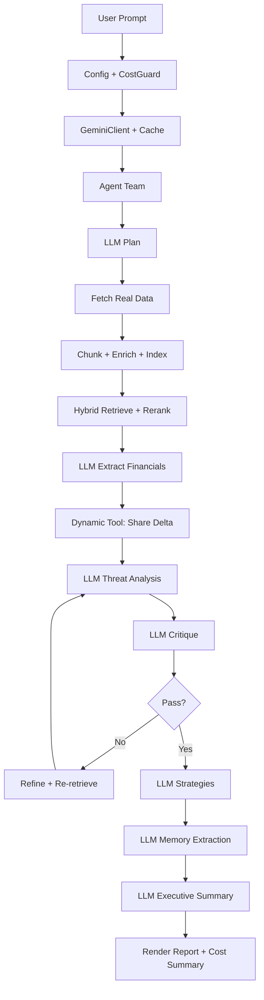

# Autonomous Strategic Analysis — Detailed Technical Documentation

## 1. Purpose and Scope

This is a **genuinely agentic** strategic analysis system — not a mock-up.

Every reasoning step (planning, extraction, threat analysis, critique, strategy generation,
memory curation, synthesis) is performed by the Gemini LLM.  Every piece of data comes from
real internet sources (SEC EDGAR, Google News, Gemini Google-Search grounding).

The system answers this C-suite question:

> "Analyze Alphabet's latest quarterly earnings focused on Google Cloud.
> Identify the biggest strategic threat to Microsoft Azure.
> Generate three actionable mitigation strategies."

## 2. Architecture Overview

```
┌──────────────────────────────────────────────────────────┐
│                     main.py (CLI)                        │
│  Config · CostGuard · GeminiClient · Agent construction  │
└──────────────────────┬───────────────────────────────────┘
                       │
                       ▼
┌──────────────────────────────────────────────────────────┐
│               AnalystAgent (orchestrator)                 │
│  Plan → Delegate → Extract → Analyse → Critique →        │
│  Refine → Strategise → Memory → Synthesise               │
└──┬────────┬────────────┬─────────────┬───────────────────┘
   │        │            │             │
   ▼        ▼            ▼             ▼
┌──────┐ ┌──────────┐ ┌──────────┐ ┌──────────────┐
│Graph │ │ News &   │ │Financial │ │  Critique    │
│Memory│ │ Data Agt │ │Modeler   │ │  Module      │
│      │ │          │ │Agent     │ │              │
│ R+W  │ │ fetch +  │ │ dynamic  │ │ LLM rubric   │
│edges │ │ retrieve │ │ tool gen │ │ scoring      │
└──────┘ └────┬─────┘ └──────────┘ └──────────────┘
              │
              ▼
┌──────────────────────────────────────────────────────────┐
│              Retrieval Pipeline (retrieval/)              │
│                                                          │
│  web_fetcher  →  chunker  →  metadata_enricher           │
│       ↓              ↓              ↓                     │
│  Documents      Chunks         Enriched Chunks            │
│                                     │                     │
│                    ┌────────────────┴────────────────┐    │
│                    ▼                                 ▼    │
│            BM25 Sparse Index            Dense Index       │
│              (free, fast)          (Gemini embeddings)    │
│                    │                         │            │
│                    └───────────┬──────────────┘            │
│                                ▼                          │
│                    Hybrid Index (RRF Fusion)               │
│                                │                          │
│                                ▼                          │
│                    LLM Reranker (score 0-1)                │
│                                │                          │
│                                ▼                          │
│                    Context Fuser (dedup + budget)          │
└──────────────────────────────────────────────────────────┘
                       │
                       ▼
┌──────────────────────────────────────────────────────────┐
│                  CostGuard (billing)                      │
│  Per-call USD tracking · Hard budget cap · Dry-run mode   │
│  Cache-hit accounting · Token-level granularity           │
└──────────────────────────────────────────────────────────┘
```

## 3. Data Sources — All Real, No Mock Data

### 3.1 Gemini Google-Search Grounding (Primary)

Gemini's `googleSearch` tool enables grounded generation: the model searches
the live web and returns text with source citations.

We issue 6 targeted queries:
1. Google Cloud latest quarterly earnings (revenue, growth, margin)
2. Microsoft Azure latest quarterly earnings
3. Amazon AWS latest quarterly earnings
4. Google Cloud vs Azure competitive analysis
5. Analyst commentary on strategic threats
6. Google Cloud growth drivers (Vertex AI, BigQuery)

Each response comes with grounding metadata (URLs, titles) that we preserve.

### 3.2 SEC EDGAR XBRL API (Structured)

Free, public API — no keys required.

- Endpoint: `https://data.sec.gov/api/xbrl/companyfacts/CIK{cik}.json`
- Provides: Revenue, Operating Income, Net Income from 10-Q/10-K filings
- We pull the last 8 filings for GOOGL, MSFT, AMZN

### 3.3 Google News RSS (Headlines + Signals)

Free RSS feed from Google News — 4 search queries for cloud earnings and
competitive dynamics.  Provides directional signals and recency context.

### 3.4 SEC EDGAR Full-Text Search (Filing Snippets)

Free-text search across recent 10-Q/10-K filings for specific terms like
"Google Cloud revenue operating income".

## 4. Hybrid Retrieval Pipeline — Deep Dive

### 4.1 Why Hybrid?

| Approach | Strength | Weakness |
|---|---|---|
| BM25 (sparse) | Exact keyword match, zero cost | Misses semantic synonyms |
| Embeddings (dense) | Semantic understanding | Costs API calls, misses exact terms |
| **Hybrid (RRF)** | **Best of both** | Slightly more complex |

### 4.2 Chunking Strategy

Sentence-aware with configurable overlap:
- **Chunk size**: ~480 tokens (≈1920 chars)
- **Overlap**: ~60 tokens — ensures context continuity across boundaries
- **Boundary**: splits on sentence endings (`.!?`) or paragraph breaks

### 4.3 Metadata Enrichment

Every chunk is tagged with:
- **company**: GOOGL / MSFT / AMZN / cross_market / unknown (regex rules)
- **topic**: revenue / growth / ai_ml / cloud / strategy / competitive / general
- **source_type**: sec_filing / grounded_search / news / unknown
- **date**: extracted ISO date or quarter string if present

This enables **filtered retrieval** (e.g., "only GOOGL revenue chunks").

### 4.4 Sparse Index — BM25 from Scratch

Full Okapi BM25 implementation:

```
score(q, d) = Σ_{t∈q}  IDF(t) · (tf(t,d)·(k₁+1)) / (tf(t,d) + k₁·(1-b+b·|d|/avgdl))
IDF(t) = ln((N - n(t) + 0.5) / (n(t) + 0.5) + 1)
```

Parameters: k₁=1.5, b=0.75 (standard defaults).
Minimal stop-word list — the reranker handles noise.

### 4.5 Dense Index — Gemini Embeddings

Model: `text-embedding-004` (**free** on Google AI Studio).
Task type: `RETRIEVAL_DOCUMENT` for indexing, `RETRIEVAL_QUERY` for search.
Similarity: cosine.

### 4.6 Hybrid Fusion — Reciprocal Rank Fusion (RRF)

```
score_rrf(d) = α/(k + rank_sparse(d)) + (1-α)/(k + rank_dense(d))
```

- **α = 0.55**: slightly favours sparse (free BM25) over dense
- **k = 60**: standard RRF constant

Optional metadata filtering applied post-fusion.

### 4.7 LLM Reranker

Candidate chunks (top-15 from hybrid) are batched and sent to Gemini.
The model scores each chunk 0.0 – 1.0 on relevance.
Chunks below **0.35** are dropped.
Top **6** survive.

Batched into groups of 10 per API call (token optimisation).

### 4.8 Context Fusion

1. **De-duplicate**: Jaccard similarity > 0.80 → merged
2. **Order by score**: highest relevance first
3. **Token budget**: accumulate until 4000 tokens
4. **Format**: each chunk gets a header like `[source=grounded_search company=GOOGL score=0.87]`

## 5. Agent Logic — Deep Dive

### 5.1 AnalystAgent.run() — 13-Step Pipeline

| Step | What | LLM? | Cost |
|---|---|---|---|
| 1 | Plan decomposition | Yes | ~200 tok |
| 2 | Fetch & index real data | Grounding + EDGAR | ~6 grounding calls |
| 3 | Retrieve financial context | Hybrid search + rerank | 1 rerank call |
| 4 | Extract structured financials | Yes (JSON mode) | ~500 tok |
| 5 | Compute market share delta | Dynamic Python tool | Free (local) |
| 6 | Retrieve qualitative signals | Hybrid search + rerank | 1 rerank call |
| 7 | Read GraphMemory | Local lookup | Free |
| 8 | Threat analysis | Yes | ~800 tok |
| 9 | Critique (rubric scoring) | Yes (JSON mode) | ~400 tok |
| 10 | Refinement loop (0-2x) | Yes + re-retrieve | ~600 tok each |
| 11 | Generate 3 strategies | Yes (JSON mode) | ~1000 tok |
| 12 | Extract memory edges | Yes (JSON mode) | ~300 tok |
| 13 | Executive summary | Yes | ~500 tok |

### 5.2 CritiqueModule — Rubric Scoring

Four criteria, each scored 0-10:
- **Depth**: Does it explain WHY, not just WHAT?
- **Evidence**: Does it cite specific data or signals?
- **Causality**: Does it identify root drivers, not symptoms?
- **Actionability**: Could a decision-maker act on this?

Overall ≥ 7 → PASS.  Otherwise NEEDS_REFINEMENT → triggers loop.

### 5.3 Refinement Loop

When critique says NEEDS_REFINEMENT:
1. LLM reads the feedback and generates 1-2 targeted search queries
2. Hybrid retrieval runs those queries
3. Threat analysis re-runs with enriched context
4. Critique re-evaluates
5. Maximum 2 loops (configurable)

### 5.4 Dynamic Memory

Old system: memory was pre-seeded and read-only.
New system: after analysis, LLM extracts relationship triples:
```
(Google Cloud, GrowthDriver, Vertex AI + BigQuery)
(Azure, Vulnerable, AI-native startup segment)
(Microsoft, StrategicAsset, Office365 enterprise base)
```
These persist in GraphMemory and influence future strategy reasoning.

## 6. Cost Control System

### 6.1 Model Choice

`gemini-2.5-flash-preview-05-20` — the **cheapest** available generation model.

Google AI Studio free tier: 15 RPM, 1M TPM, 1500 RPD — **completely free**.
Even on pay-as-you-go: $0.15 per million input tokens, $0.60 per million output.

### 6.2 CostGuard Module

Every API call flows through CostGuard which:
1. **Records** input/output tokens and computes incremental USD cost
2. **Checks** cumulative spend against the hard budget cap BEFORE each call
3. **Raises `BudgetExceeded`** immediately if the cap would be exceeded
4. Separately tracks cache hits and embedding tokens (free)

### 6.3 Aggressive Caching

diskcache stores every API response keyed by SHA-256 of the prompt.
Re-runs are **instant and free**.

### 6.4 Dry-Run Mode

`python main.py --dry-run` — skips ALL LLM/embedding/grounding calls.
Useful for testing plumbing, verifying config, and understanding flow.

### 6.5 Token Budget Hierarchy

| Level | Control | Default |
|---|---|---|
| Per-response | `max_output_tokens` | 4096 |
| Reranker | batch of 10, cap 1024 output | Small |
| Context fusion | `context_token_budget` | 4000 |
| Critique | 512 output | Tiny |
| Total budget | CostGuard `budget_usd` | $0.50 |

### 6.6 Expected Cost Per Run

| Component | Est. tokens | Est. cost |
|---|---|---|
| 6 grounding queries | ~6000 in, ~6000 out | $0.0045 |
| 2 rerank calls | ~2000 in, ~400 out | $0.0005 |
| Financial extraction | ~1500 in, ~500 out | $0.0005 |
| Threat analysis | ~2000 in, ~500 out | $0.0006 |
| Critique (1-2x) | ~1500 in, ~300 out | $0.0004 |
| Strategies | ~2000 in, ~800 out | $0.0008 |
| Memory + summary | ~2000 in, ~500 out | $0.0006 |
| Planning | ~200 in, ~300 out | $0.0002 |
| Embeddings | ~10000 tokens | **FREE** |
| **TOTAL** | | **~$0.008 – $0.03** |

## 7. End-to-End Runtime Flow

See `runtime_flow.mmd` for the full Mermaid diagram.



## 8. Configuration Reference

All config lives in `config.py`:

| Knob | Default | Purpose |
|---|---|---|
| `generation_model` | gemini-2.5-flash-preview-05-20 | Cheapest flash model |
| `embedding_model` | text-embedding-004 | Free embeddings |
| `max_output_tokens` | 4096 | Hard cap per response |
| `budget_usd` | 0.50 | Hard cost cap |
| `dry_run` | False | Skip all API calls |
| `hybrid_alpha` | 0.55 | Sparse/dense weight |
| `top_k_retrieval` | 15 | Candidates from hybrid |
| `top_k_rerank` | 6 | After LLM reranking |
| `rerank_relevance_floor` | 0.35 | Drop below this |
| `context_token_budget` | 4000 | Fused context limit |
| `max_critique_loops` | 2 | Refinement iterations |

## 9. How to Run

```bash
# Dry run (zero cost)
python main.py --dry-run

# Real run
python main.py

# With custom budget
python main.py --budget 0.25

# Clear cache first
python main.py --clear-cache
```

## 10. Extending to Production

1. **More data sources**: Add earnings transcript APIs, analyst report APIs
2. **Vector DB**: Replace in-memory dense index with ChromaDB / Pinecone
3. **Persistent memory**: Save GraphMemory to file/DB between runs
4. **Multi-quarter**: Compare trends across 4-8 quarters
5. **Confidence scores**: Add uncertainty quantification to each claim
6. **Citation mapping**: Trace every report sentence to its source chunk
7. **PDF export**: Render report to PDF via WeasyPrint

## 11. Known Limitations

1. SEC EDGAR data may lag 30-60 days behind latest earnings
2. Google-Search grounding quality depends on web freshness
3. No real-time stock price or analyst estimate integration
4. Single-run analysis (no persistent multi-session learning yet)
5. No API key rotation or multi-key support

## 12. Glossary

| Term | Meaning |
|---|---|
| BM25 | Best-Match-25 — classic sparse retrieval algorithm |
| RRF | Reciprocal Rank Fusion — merges multiple ranking lists |
| Grounding | Gemini feature that searches the web and cites sources |
| CostGuard | Module that tracks spending and enforces budget cap |
| GoT | Graph of Thoughts — structured reasoning (we use LLM planning) |
| XBRL | eXtensible Business Reporting Language — structured SEC data |
