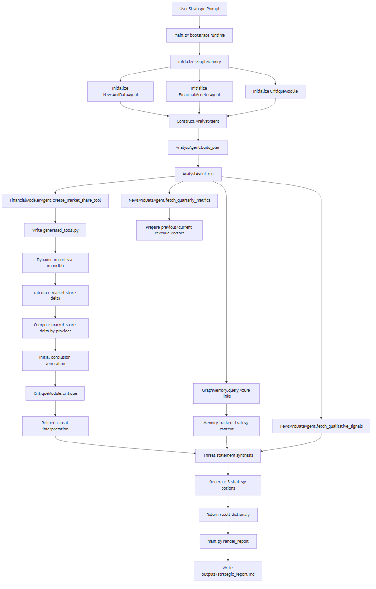

# Use Case 3: Autonomous Strategic Analysis of Google Cloud

## What this project does

This use case builds a multi-agent strategic analysis pipeline that answers this executive question:

Analyze Alphabet's latest quarterly earnings (with focus on Google Cloud), identify the biggest strategic threat to Microsoft Azure, and recommend three actionable mitigation strategies.

The implementation is deterministic, offline-friendly, and easy to inspect end to end.

## High-level workflow

1. AnalystAgent creates a plan.
2. NewsAndDataAgent fetches structured KPI and qualitative inputs.
3. FinancialModelerAgent dynamically creates a market-share tool at runtime.
4. CritiqueModule checks whether conclusions are causal, not superficial.
5. GraphMemory injects strategic context.
6. main.py synthesizes and writes the final report.

## Mermaid flow

See runtime flow in:

- runtime_flow.mmd

Rendered image:

Detailed markdown documentation with embedded Mermaid is in:

- DETAILED_DOCUMENTATION.md

## Files and purpose

1. main.py
  - Entry point and orchestrator.
  - Calls AnalystAgent and renders final markdown report.

2. agents.py
  - Contains AnalystAgent, NewsAndDataAgent, FinancialModelerAgent, CritiqueModule, GraphMemory.

3. sample_inputs/quarterly_cloud_metrics.json
  - Structured current/previous quarter KPI data for Google Cloud, Azure, and AWS.

4. sample_inputs/qualitative_signals.json
  - Textual market signals used for causal interpretation.

5. generated_tools.py
  - Auto-created at runtime by FinancialModelerAgent.
  - Includes calculate_market_share_delta(previous_revenue, current_revenue).

6. outputs/strategic_report.md
  - Final generated strategic report.

## Data lineage and assumptions

1. sample_inputs are synthetic demonstration datasets created for this project.
2. Inputs were not directly pulled from live SEC, transcript APIs, or paid terminals.
3. The patterns are modeled on publicly discussed cloud dynamics:
  - Google Cloud AI-led growth narrative.
  - Azure enterprise integration strength.
  - AWS scale and margin profile.

Assumptions:

1. Revenue fields are treated as comparable proxies for sequential share calculations.
2. Current and previous periods are assumed aligned across all providers.
3. Qualitative signals are directional, not definitive causal proof.
4. Strategy costs and outcomes are planning-level estimates.

## Run instructions

Run from this folder:

python main.py

Expected output:

1. Console shows analysis completed and report path.
2. outputs/strategic_report.md is created or overwritten.

## Detailed reading path

If you want full technical understanding, read in this order:

1. DETAILED_DOCUMENTATION.md
2. agents.py
3. main.py
4. sample_inputs/*.json
5. outputs/strategic_report.md
