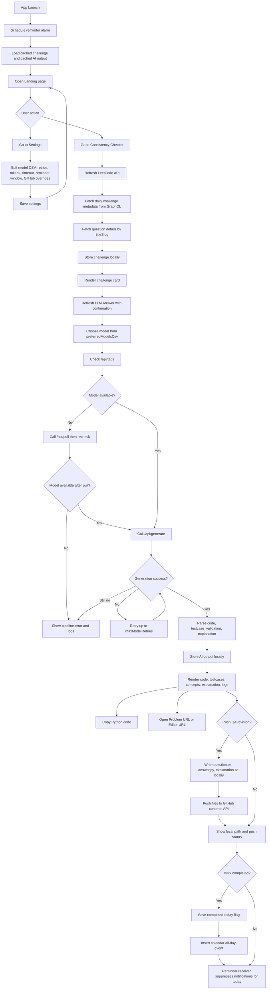

# LeedCode Checker Ollama: Detailed Technical Documentation

## 1. Purpose

LeedCode Checker Ollama is the feature-parity variant of the LeetCode Consistency Checker that keeps the same app workflow but uses Ollama for LLM generation.

Core goals:
1. Fetch the LeetCode daily challenge and cache it locally.
2. Generate Python solution, testcase validation, and explanation via Ollama.
3. Track daily completion with reminders and calendar marking.
4. Export revision files locally and push to GitHub.

## 2. Architecture

1. UI layer: Compose multi-screen flow (Landing, Checker, Settings).
2. ViewModel layer: app orchestration, state management, settings persistence, push orchestration.
3. Data layer: LeetCode GraphQL + Ollama APIs + GitHub contents API.

## 3. Main Features

### 3.1 App flow

1. Landing screen with primary consistency CTA.
2. Checker screen for API refresh, LLM refresh, copy/push/complete operations.
3. Settings screen for model/runtime/reminder/GitHub overrides.

### 3.2 Data refresh model

1. Refresh LeetCode API loads latest daily challenge only.
2. Refresh LLM Answer is a separate user-confirmed action.
3. This split avoids accidental repeated LLM calls.

### 3.3 Ollama generation behavior

1. Uses preferred model CSV from settings.
2. Picks first preferred model available in local `/api/tags`; falls back to first preferred value.
3. Ensures model availability via `/api/pull` if missing.
4. Uses tagged response contract:
1. `<leetcode_python3_code>`
2. `<testcase_validation>`
3. `<explanation>`
5. Applies retry logic and logs request/response details with timestamps.

### 3.4 Local persistence

1. Challenge and AI output are cached in SharedPreferences.
2. Today completion flag is persisted by IST date.
3. App reload restores previous challenge/answer state.

### 3.5 Reminders and completion

1. Repeating alarm schedules reminder receiver.
2. Reminder only fires within configured IST hour window.
3. Reminder is skipped once today is marked completed.
4. Mark Completed can create an all-day calendar event.

### 3.6 QA revision export and GitHub push

1. Generates `question.txt`, `answer.py`, `explanation.txt`.
2. Saves files under revision root/date in app external files.
3. Pushes same files to GitHub via contents upsert API.
4. Supports owner/repo/branch overrides from settings.

### 3.7 UI content controls

1. Show/hide generated code.
2. Show/hide testcase validation.
3. Show/hide concepts extracted from explanation.
4. Show/hide full explanation.
5. Show/hide pipeline debug logs.

### 3.8 Theme behavior

1. Follows phone system dark/light mode via `isSystemInDarkTheme()`.
2. Uses explicit dark/light Material3 color schemes.

## 4. Configuration

From `local.properties`:
1. `OLLAMA_BASE_URL`
2. `OLLAMA_MODEL`
3. `GITHUB_TOKEN`
4. `GITHUB_OWNER`
5. `GITHUB_REPO`
6. `GITHUB_BRANCH`

## 5. Build

From `mobile_apps/leedcode_checker_ollama`:
1. `.\gradlew :app:assembleDebug`

APK output:
1. `app/build/outputs/apk/debug/app-debug.apk`

## 6. Mermaid Flow Diagram

Rendered image:

Source file:

`docs/runtime_flow.mmd`

