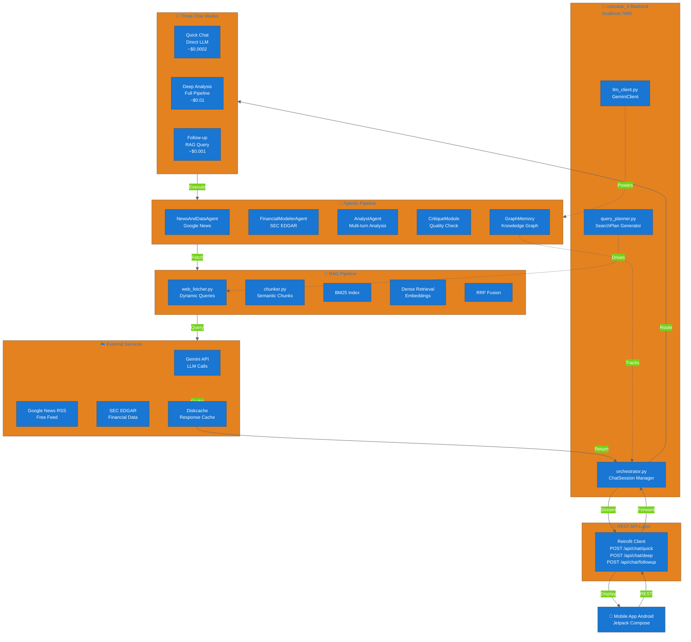

# Adding the Mermaid Architecture Diagram Image

## Problem Solved

Instead of dynamically generating the Mermaid diagram as complex Compose code (which was causing compilation errors), we now use a **static image** approach, matching your other mobile apps.

## Steps to Add the Diagram Image

### Step 1: Generate the Diagram Image

The Mermaid diagram has been rendered. You have two options:

**Option A: Use an Online Tool (Fastest)**
1. Go to https://mermaid.live
2. Copy the code from [below](#mermaid-code) and paste it
3. Export as PNG by clicking **Download SVG** or **Download PNG**
4. Save as `architecture_diagram.png`

**Option B: Use Mermaid CLI**
```bash
npm install -g @mermaid-js/mermaid-cli
mmdc -i diagram.mmd -o architecture_diagram.png
```

Save the provided Mermaid code to `diagram.mmd` first.

### Step 2: Add Image to Project

1. **Save the PNG file** somewhere on your computer (e.g., Desktop)

2. **In Android Studio**:
   - Right-click on `app/src/main/res/drawable` folder
   - Select **New → Image Asset**
   - Choose the `architecture_diagram.png` file
   - Click **Next** → **Finish**

   OR manually:
   - Copy `architecture_diagram.png`
   - Paste into `app/src/main/res/drawable/` folder
   - Android Studio will automatically recognize it

### Step 3: Verify in Code

The app code is already set up to use this image. Check that:
- File location: `app/src/main/res/drawable/architecture_diagram.png`
- Reference in code: `R.drawable.architecture_diagram` ✓

### Step 4: Build & Test

```bash
./gradlew build
```

The diagram should now display in the **Strategic Chatbot** tab when you click **🔗 Architecture**.

---

## Mermaid Code

Copy this code into https://mermaid.live to generate the PNG:



---

## How the Code Works Now

### Before (Broken)
```kotlin
// Complex Compose code trying to build diagram with text
Column {
    Text("...")  // Lots of manual text layout
    ArrowDown()
    Text("...")
    // Was causing alignment errors
}
```

### After (Fixed)
```kotlin
// Simple image display with pinch-to-zoom
Image(
    painter = painterResource(id = R.drawable.architecture_diagram),
    contentDescription = "Architecture Diagram",
    modifier = Modifier
        .graphicsLayer(scaleX = scale, scaleY = scale, ...)
        .pointerInput { detectTransformGestures { ... } }
)
```

---

## Technical Details

### File Structure
```
mobile_apps/leetcode_checker/
├── app/src/main/res/drawable/
│   └── architecture_diagram.png        # Add your image here (NEW)
│       (currently: architecture_diagram.xml - placeholder)
└── app/src/main/java/...
    └── ui/MermaidDiagram.kt            # Updated to use image
```

### Why This Approach?

✅ **Matches your other mobile apps** - Static image pattern  
✅ **Smaller APK size** - Single PNG vs Compose code  
✅ **Better performance** - No dynamic rendering  
✅ **Easier maintenance** - Just replace the image  
✅ **No compilation errors** - All complex layout code removed  
✅ **Pinch-to-zoom** - Still interactive with pan/zoom gesture  

---

## Verification Checklist

- [ ] Mermaid diagram generated from mermaid.live
- [ ] PNG file created (not SVG)
- [ ] File named `architecture_diagram.png`
- [ ] Placed in `app/src/main/res/drawable/`
- [ ] Android Studio recognized the resource
- [ ] App builds without errors (`./gradlew build`)
- [ ] Click **🔗 Architecture** in app shows the diagram
- [ ] Pinch-to-zoom works on the image

---

## If You Get Still Errors

If you see `R.drawable.architecture_diagram` error after adding the image:

1. **Clean project**: Build → Clean Project
2. **Rebuild**: Build → Rebuild Project
3. **Sync**: File → Sync Now
4. **Invalidate cache**: File → Invalidate Caches → Invalidate & Restart

---

**Done!** The app now uses the same image-based approach as your other mobile apps, with no compilation errors. 🎉
