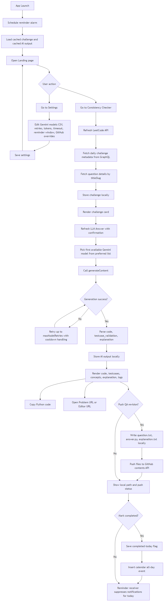
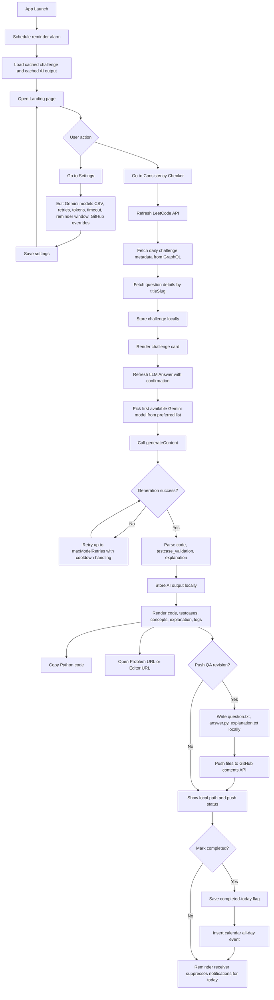

# LeetCode Checker: Detailed Technical Documentation

## 1. Purpose and Scope

LeetCode Checker is an Android app built with Kotlin + Jetpack Compose.

Primary goals:
1. Fetch the current LeetCode Daily Challenge.
2. Fetch and normalize the problem statement.
3. Autonomously request a detailed explanation and Python 3 solution from Gemini.
4. Display both problem and generated answer in the app UI.
5. Provide a practical final step to open LeetCode editor and manually submit.

The app intentionally does not auto-sign-in or auto-submit to LeetCode accounts, for security and reliability reasons.

## 2. High-Level Architecture

The app uses a simple UI + ViewModel + Repository layering pattern.

1. UI Layer (Compose):
- Renders state.
- Dispatches user actions.
- Shows loading, error, fetched problem, AI answer, and completion toggle.

2. ViewModel Layer:
- Owns reactive UI state.
- Orchestrates the sequence:
1. Fetch daily challenge.
2. Trigger AI answer generation.
3. Merge results into state.

3. Data Layer (Repository + Retrofit APIs):
- LeetCode GraphQL client.
- Gemini REST client.
- Model mapping and response normalization.

## 3. Project Structure

Core files:

- app/src/main/java/com/vignesh/leetcodechecker/MainActivity.kt
- app/src/main/java/com/vignesh/leetcodechecker/LeetCodeViewModel.kt
- app/src/main/java/com/vignesh/leetcodechecker/data/LeetCodeRepository.kt
- app/src/main/java/com/vignesh/leetcodechecker/data/LeetCodeApi.kt
- app/src/main/java/com/vignesh/leetcodechecker/data/GeminiApi.kt
- app/src/main/AndroidManifest.xml
- app/src/main/res/xml/network_security_config.xml
- app/build.gradle.kts

Assets:

- app/src/main/res/drawable/leetcode_logo.png

## 4. End-to-End Runtime Flow

### 4.1 User-triggered flow

1. User taps LeetCode button.
2. ViewModel sets isLoading = true.
3. Repository calls LeetCode GraphQL endpoint for daily challenge metadata.
4. Repository calls LeetCode GraphQL endpoint again for question content via titleSlug.
5. Repository returns DailyChallengeUiModel to ViewModel.
6. ViewModel updates state with challenge and sets isAiLoading = true.
7. ViewModel calls repository Gemini generation method.
8. Repository builds a system prompt + user prompt using challenge data.
9. Repository calls Gemini generateContent API.
10. Gemini text response is parsed and returned.
11. ViewModel stores aiAnswer and clears ai loading.
12. UI renders complete problem + detailed answer + copy button.

### 4.2 Manual completion flow

1. User taps Open LeetCode Editor (Manual Submit).
2. Browser opens problem URL.
3. User signs in and submits solution manually.
4. User taps Mark as Completed in app to track progress state for current session.

## 5. API Integrations

### 5.1 LeetCode integration

Base URL:
- https://leetcode.com/

Endpoint:
- POST /graphql

Queries used:

1. Daily challenge query
- activeDailyCodingChallengeQuestion
- fields: date, link, question metadata

2. Question detail query
- question(titleSlug: ...)
- fields: content, exampleTestcases

### 5.2 Gemini integration

Base URL:
- https://generativelanguage.googleapis.com/

Endpoint:
- POST /v1beta/models/{model}:generateContent?key=...

Model configured:
- gemini-2.0-flash

Request payload contains:
1. systemInstruction
2. contents (user prompt)
3. generationConfig (temperature and maxOutputTokens)

Response parsing strategy:
- candidates[0].content.parts[*].text joined into one string.
- Empty output is treated as failure.

## 6. Data Models and State

### 6.1 DailyChallengeUiModel

Fields:
1. date
2. title
3. titleSlug
4. difficulty
5. questionId
6. tags
7. url
8. descriptionPreview
9. fullStatement

descriptionPreview is optimized for compact display.
fullStatement is used to build richer AI prompts.

### 6.2 LeetCodeUiState

Fields:
1. isLoading
2. challenge
3. aiAnswer
4. isAiLoading
5. error
6. aiError

This enables independent error handling for problem fetch and AI generation.

## 7. Prompting Strategy

Prompt profile label:
- Prompt for Leetcode_solver

The repository builds:
1. A concise system prompt defining expected sections.
2. A user prompt containing daily metadata + problem statement.

Expected answer shape:
1. Problem understanding
2. Brute-force idea
3. Optimal approach
4. Algorithm steps
5. Complexity
6. Python 3 code
7. Dry run + edge cases

## 8. Security and Secrets

### 8.1 API key handling

Key source:
- local.properties
- property name: GEMINI_API_KEY

Build injection:
- app/build.gradle.kts reads local.properties
- buildConfigField("GEMINI_API_KEY", ...)

Important:
1. local.properties must never be committed.
2. If key is exposed publicly, rotate it in Google AI Studio and update local.properties.

### 8.2 Network security behavior

Manifest enables custom network config:
- android:networkSecurityConfig="@xml/network_security_config"

Network config trusts:
1. system certificates
2. user certificates

Repository debug mode additionally uses a permissive TLS fallback for development environments with broken trust chains.

Important:
- This fallback is gated by BuildConfig.DEBUG and should not be used for production security guarantees.

## 9. UI Behavior Details

Main UI blocks:
1. Header with logo + title.
2. LeetCode fetch button.
3. Loading indicator for problem fetch.
4. Problem card with metadata + snippet.
5. Open Problem button.
6. Open LeetCode Editor (Manual Submit) button.
7. AI generation loading indicator.
8. AI error block.
9. Detailed Answer block.
10. Copy AI Answer button.
11. Mark as Completed toggle.

Scroll behavior:
- Entire content column is vertically scrollable to support long AI output.

Clipboard behavior:
- AI answer can be copied via Android clipboard service.

## 10. Build and Run

### 10.1 Build debug APK

From mobile_apps/leetcode_checker:

- .\build_apk.ps1 -Variant debug

Output:
- app/build/outputs/apk/debug/app-debug.apk

### 10.2 Build release APK

1. Copy keystore.properties.example to keystore.properties.
2. Fill signing values.
3. Run:
- .\build_apk.ps1 -Variant release

Output:
- app/build/outputs/apk/release/app-release.apk

## 11. Failure Modes and Troubleshooting

### 11.1 LeetCode fetch fails

Likely causes:
1. Network unavailable.
2. TLS/certificate issues on emulator.
3. API schema/response shape changes.

Where handled:
- LeetCodeRepository.fetchDailyChallenge
- ViewModel error field: error

### 11.2 Gemini generation fails

Likely causes:
1. Missing/invalid GEMINI_API_KEY.
2. Quota exhaustion.
3. Temporary API availability issue.

Where handled:
- LeetCodeRepository.generateDetailedAnswer
- ViewModel error field: aiError

### 11.3 Emulator deployment issues

Likely causes:
1. Missing x86_64 system image.
2. Stale AVD metadata.
3. ADB offline state.

Typical fixes:
1. Install matching system image.
2. Recreate AVD.
3. Restart ADB server.

## 12. Why Auto Submit Is Not Implemented

LeetCode auto sign-in + auto submission from app is intentionally not implemented.

Reasons:
1. Credential security risk.
2. No stable public supported mobile-submit automation path.
3. Browser automation reliability issues and ToS risk.

Current safe approach:
1. App generates solution autonomously.
2. User opens editor link and submits manually.

## 13. Extension Points

If you want to extend this app, recommended next additions:

1. Persist history by date in local storage (Room/DataStore).
2. Extract only Python code block from AI answer and show separate copy button.
3. Add retry button for AI generation without refetching problem.
4. Add structured JSON output mode for deterministic rendering.
5. Add token usage and latency metrics in debug panel.

## 14. Sequence Summary (Compact)

1. Tap LeetCode.
2. Fetch daily metadata from LeetCode GraphQL.
3. Fetch full statement via titleSlug.
4. Build DailyChallengeUiModel.
5. Call Gemini with system + user prompt.
6. Parse generated answer.
7. Render answer and allow copy.
8. Open LeetCode editor for manual submit.
9. Mark completed.

This is the current implemented autonomous workflow boundary for the application.

## 15. Mermaid Flow Diagram

Rendered image:

Source file:

`docs/runtime_flow.mmd`

