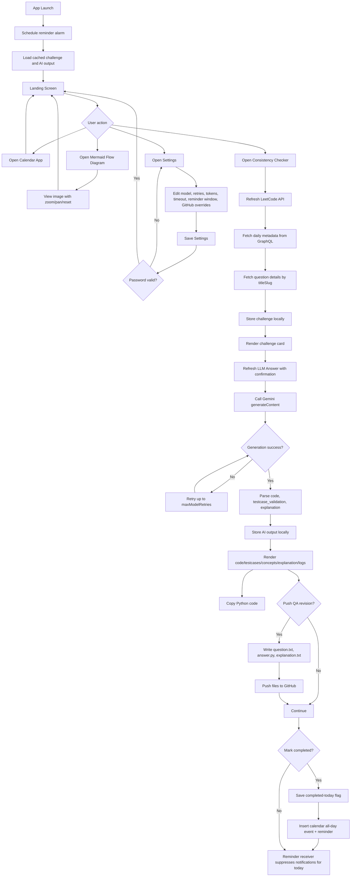

# LeetCode Checker: Detailed Technical Documentation

## 1. Purpose

LeetCode Checker is an Android app for daily LeetCode consistency.
It keeps a manual-first workflow: the app fetches the problem, generates a solution with Gemini, and helps you track completion.

Core goals:
1. Fetch and cache the LeetCode daily challenge.
2. Generate Python code, testcase validation, and explanation via Gemini.
3. Track daily completion with reminders and calendar insertion.
4. Export and optionally push revision files to GitHub.

## 2. Architecture

1. UI layer: Jetpack Compose multi-screen app.
2. ViewModel layer: state orchestration and persistence.
3. Data layer: LeetCode GraphQL + Gemini + GitHub contents API.

## 3. Main Features

### 3.1 App flow

1. Landing screen actions:
- Open Consistency Checker.
- Open Calendar app.
- Open Mermaid Flow Diagram viewer.
- Open Settings.
2. Checker screen handles API refresh, Gemini refresh, copy/export/push, completion.
3. Settings screen manages model/runtime/reminder/GitHub overrides.

### 3.2 Settings update protection

1. Save Settings requires password confirmation.
2. Password value comes from BuildConfig key `SETTINGS_UPDATE_PASSWORD`.
3. If key is missing/blank, fallback is `1234`.

### 3.3 Data refresh model

1. Refresh LeetCode API is manual.
2. Refresh LLM Answer is manual and confirmation-gated.
3. This split prevents accidental repeated LLM calls.

### 3.4 Gemini generation behavior

1. Uses preferred model CSV from settings.
2. Applies retry policy (`maxModelRetries`) and timeout/token controls from settings.
3. Parses tagged contract:
- `<leetcode_python3_code>`
- `<testcase_validation>`
- `<explanation>`
4. Writes timestamped pipeline logs for troubleshooting.

### 3.5 Local persistence

1. Challenge and AI output are cached in SharedPreferences.
2. Completion is persisted by IST date.
3. App restores cached data on relaunch.

### 3.6 Reminders and completion

1. Repeating alarm drives reminder receiver.
2. Reminder only fires within configured IST window.
3. Reminder is suppressed once today is marked completed.
4. Mark Completed attempts to insert an all-day calendar event + reminder row.

### 3.7 QA revision export and GitHub push

1. Generates `question.txt`, `answer.py`, `explanation.txt`.
2. Saves files under revision root/date in app external storage.
3. Pushes same files to GitHub via contents upsert API.
4. Supports owner/repo/branch overrides from settings.

### 3.8 Runtime flow diagram viewer

1. Landing screen has `Mermaid Flow Diagram` option.
2. Viewer shows packaged image `runtime_flow_diagram.png`.
3. Supports pinch zoom, drag pan, and Reset Zoom.

### 3.9 Theme behavior

1. Follows system dark/light mode (`isSystemInDarkTheme()`).
2. Uses explicit Material3 dark/light color schemes.

## 4. Configuration

Configure `local.properties` in `mobile_apps/leetcode_checker`:

1. `GEMINI_API_KEY`
2. `GITHUB_TOKEN`
3. `GITHUB_OWNER`
4. `GITHUB_REPO`
5. `GITHUB_BRANCH`
6. `SETTINGS_UPDATE_PASSWORD`

Example:

```properties
GEMINI_API_KEY=
GITHUB_TOKEN=
GITHUB_OWNER=VigneshwaraChinnadurai
GITHUB_REPO=Google_Prep
GITHUB_BRANCH=main
SETTINGS_UPDATE_PASSWORD=replace_with_strong_value
```

## 5. Build

From `mobile_apps/leetcode_checker`:

1. `./gradlew :app:assembleDebug`

APK output:

1. `app/build/outputs/apk/debug/app-debug.apk`

## 6. Mermaid Runtime Flow Diagram

Rendered image:


Source file:

`docs/runtime_flow.mmd`


