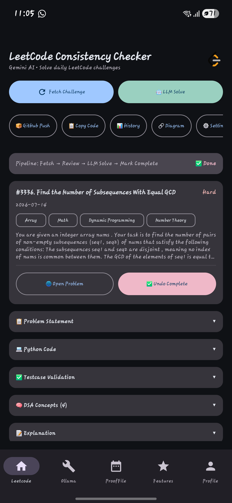
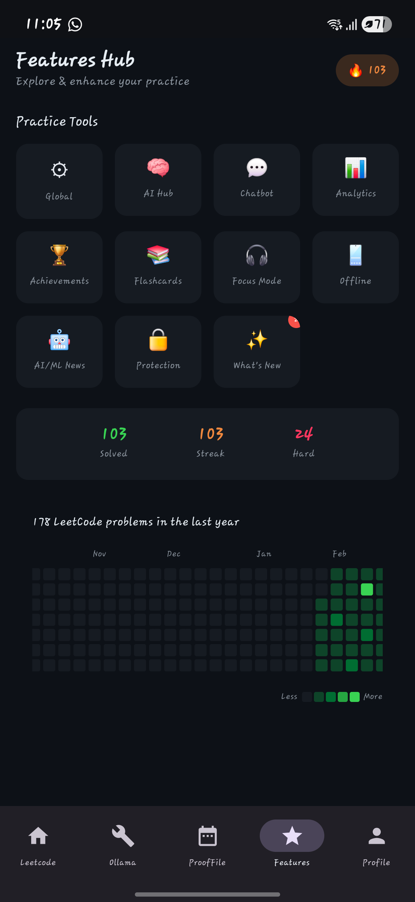
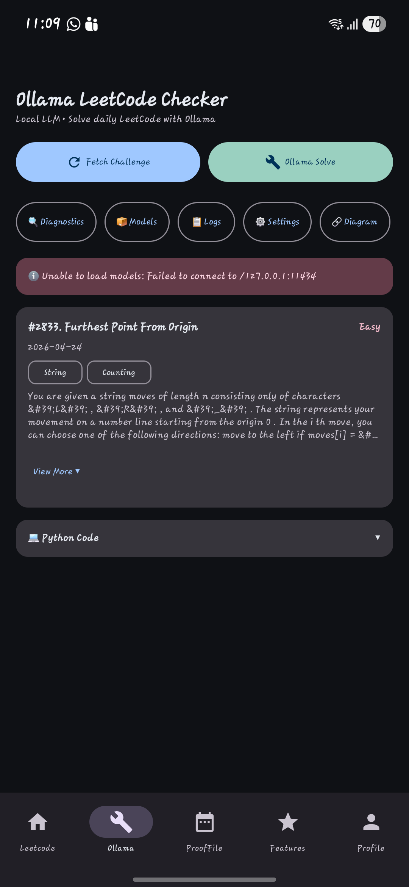
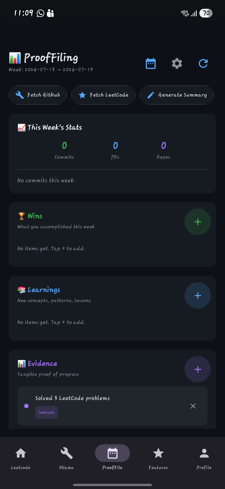
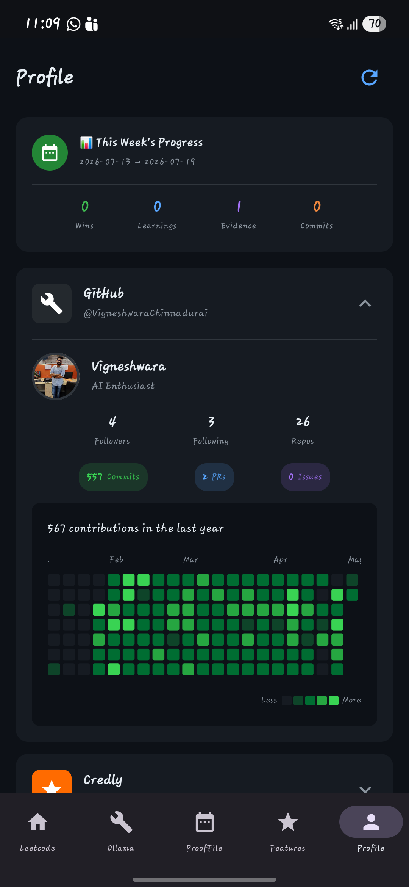

# 📱 LeetCode Checker

**Your Personal Development Companion for Technical Interview Preparation**

[](https://developer.android.com)
[](https://kotlinlang.org)
[](https://developer.android.com/jetpack/compose)
[](LICENSE)

---

## 🚀 Features

| Feature | Description |
|---------|-------------|
| 🎯 **LeetCode Tracking** | Fetch, analyze, and solve LeetCode problems with AI assistance |
| 🤖 **AI Interview Prep** | Practice coding interviews with Google Gemini AI |
| 💬 **Strategic Chatbot** | Deep analysis of companies, markets, and career strategies |
| 📰 **AI/ML News, with Daily Alerts** | Live feed from arXiv (cs.AI, quant-ph), OpenAI News, and Hugging Face Blog — auto-fetched every morning at 5 AM, with one notification per new article that stays in the notification shade until you swipe it away |
| 📊 **GitHub Integration** | View contributions, sync solutions to your repository, all pushes on one configurable token |
| 🏆 **Profile Dashboard** | Unified view of GitHub, live Credly badges, LinkedIn, and Medium |
| 🔥 **Real Contribution Heatmap** | The Features Hub heatmap is fetched directly from your LeetCode profile's submission calendar — the same per-day data leetcode.com itself renders — not approximated from local app history |
| 🔄 **Local AI (Ollama)** | Run AI models locally for privacy and offline use |
| 📈 **Analytics & Goals** | Track progress, set goals, earn achievements |
| 🗂️ **Proof Filing** | Weekly GitHub/LeetCode activity summaries, auto-pushed as markdown |

---

## 📚 Documentation

| Document | Description |
|----------|-------------|
| 📖 **[USER_MANUAL.md](USER_MANUAL.md)** | Complete user guide with all features explained |
| 🔧 **[BUILD_GUIDE.md](BUILD_GUIDE.md)** | How to build APK from source, signing setup |
| 🤖 **[CLAUDE.md](CLAUDE.md)** | Architecture conventions and operational notes for AI-assisted development on this codebase |
| 📋 **[local.properties.template](local.properties.template)** | Configuration template with instructions |

---

## ⚡ Quick Start

### 1. Clone the Repository

```bash
git clone https://github.com/VigneshwaraChinnadurai/Google_Prep.git
cd Google_Prep/mobile_apps/leetcode_checker
```

### 2. Configure Build-Time Settings

```bash
# Copy template
cp local.properties.template local.properties

# Edit and fill in your values
# - sdk.dir: path to your Android SDK
# - GEMINI_API_KEY: Get from https://aistudio.google.com/app/apikey
#   (only used as a compile-time default; see step 5)
```

`GITHUB_TOKEN` is **not** set here — see step 5.

### 3. Build

```bash
# Windows PowerShell
$env:JAVA_HOME = "C:\Program Files\Android\Android Studio\jbr"
.\gradlew assembleDebug

# macOS/Linux
export JAVA_HOME="/Applications/Android Studio.app/Contents/jbr/Contents/Home"
./gradlew assembleDebug
```

### 4. Install

APK location: `app/build/outputs/apk/debug/app-debug.apk`

### 5. Configure the GitHub Token (in-app)

The GitHub token isn't a build-time secret — it's entered once inside the app and stored only on your device, so you can rotate it without rebuilding:

1. Open the app → **Features** tab → **Global Settings** tile
2. Generate a token at [github.com/settings/tokens](https://github.com/settings/tokens)
   - Fine-grained token: grant **Contents: Read and write** on the target repo
   - Classic token: `repo`, `read:user`, `user:email` scopes
3. Paste it into **Global GitHub Token**, tap **Test Token** to confirm write access, then **Save Settings**

This one token is used for every GitHub-touching feature: profile lookups, daily revision pushes, and Proof Filing.

---

## 🔑 Required API Keys

| Key | Required For | Configured Via | Get It From |
|-----|--------------|-----------------|-------------|
| `GEMINI_API_KEY` | AI features (Interview Prep, Chatbot, Analysis) | `local.properties` (compile-time), overridable in Global Settings | [Google AI Studio](https://aistudio.google.com/app/apikey) |
| GitHub token | GitHub Profile, Solution Sync, Proof Filing | **In-app only** — Global Settings screen | [GitHub Settings](https://github.com/settings/tokens) |

No key is required for AI/ML News (public RSS feeds) or the LeetCode contribution heatmap (public GraphQL endpoint) — both work out of the box.

---

## 📱 App Structure

```
┌─────────────────────────────────────────┐
│              LeetCode Checker           │
├─────────────────────────────────────────┤
│                                         │
│   🏠 Leetcode    - Fetch & solve daily  │
│   🔧 Ollama      - Local AI challenges  │
│   🗂️ ProofFile   - Weekly activity log  │
│   ⭐ Features    - Hub: Interview,      │
│                    News, Chatbot,       │
│                    Settings, and more   │
│   👤 Profile     - GitHub, Credly, etc  │
│                                         │
└─────────────────────────────────────────┘
```

The Features tab is a hub screen. Its **Practice Tools** grid is intentionally short and non-scrolling — Global Settings, AI Hub, Chatbot, Analytics, Achievements, Flashcards, Focus Mode, Offline, AI/ML News, Protection, and What's New. Below it: your solved/streak/hard stats, then the real LeetCode contribution heatmap. Profile, GitHub Profile, and a quick "Random Challenge" picker used to live here too — they were removed as redundant (Profile already has its own bottom-nav tab) or as clutter, per deliberate cleanup.

Goals, Interview Prep, and Leaderboard screens still exist in the codebase but currently have no navigation entry point into them from the UI — they were pulled from the Features grid as part of the same cleanup and are candidates for either a new entry point or removal in a future pass.

---

## 📸 Screenshots

| Leetcode | Features Hub |
|:---:|:---:|
|  |  |
| Daily challenge, fetched from LeetCode's own GraphQL API, solved end-to-end with AI assistance | Practice Tools grid (no scroll), streak badge, solved/streak/hard stats, and the real per-day contribution heatmap |

| Ollama | ProofFiling |
|:---:|:---:|
|  |  |
| Same daily-challenge flow, solved with a locally-hosted Ollama model instead of Gemini | Weekly wins/learnings/evidence log, auto-fetched from GitHub and LeetCode activity |

| Profile |
|:---:|
|  |
| GitHub stats and contribution graph, Credly badges, and weekly ProofFiling summary, all in one place |

---

## 🛠️ Tech Stack

- **Language**: Kotlin 1.9
- **UI Framework**: Jetpack Compose (Material 3)
- **Architecture**: MVVM with StateFlow
- **Networking**: Retrofit + Moshi/org.json — every integration (GitHub, LeetCode, Gemini, AI news RSS) is raw REST via Retrofit/OkHttp, deliberately no official cloud SDKs, for one consistent pattern across the app
- **AI Backend**: Google Gemini API / Ollama
- **Image Loading**: Coil
- **Background work**: `AlarmManager` (exact, wake-idle alarms) for the two daily auto-fetches; `WorkManager` for periodic backups
- **Min SDK**: 24 (Android 7.0)
- **Target SDK**: 35 (Android 14)

---

## 🔔 Daily Background Jobs

Two independent daily alarms run whether or not the app is open:

| Time (IST) | Job | Behavior |
|---|---|---|
| 5:00 AM | AI/ML News fetch | Pulls fresh articles from all configured feeds. One notification per **new** article (not seen before), each with its own notification ID. Notifications do **not** auto-dismiss when tapped or when the app is opened — they stay in the shade until manually swiped away. First-ever run seeds a baseline silently (no notification burst for pre-existing articles); every run after that only notifies for genuinely new content, capped at 15 notifications per run. |
| 6:00 AM | Daily LeetCode challenge fetch | Pre-fetches the day's challenge so it's ready without opening the app; posts a single summary notification. |

Both use `AlarmManager.setExactAndAllowWhileIdle`, falling back to an inexact repeating alarm if exact-alarm permission is ever revoked.

---

## 📁 Project Structure

```
leetcode_checker/
├── app/
│   └── src/main/
│       ├── java/com/vignesh/leetcodechecker/
│       │   ├── ai/            # Recommendation/hints/knowledge-graph engines
│       │   ├── api/           # Retrofit API interfaces
│       │   ├── data/          # Data models & repositories (GitHub, LeetCode, AI News, Gemini, Ollama)
│       │   ├── llm/           # LLM provider abstraction (Gemini/Ollama/local llama.cpp)
│       │   ├── models/        # Shared data models (chatbot, pipeline)
│       │   ├── pipeline/      # Strategic-analysis / RAG pipeline
│       │   ├── prooffiling/   # Weekly proof-filing feature
│       │   ├── repository/    # Data repositories
│       │   ├── security/      # Uninstall protection (device admin)
│       │   ├── ui/            # Compose screens
│       │   ├── viewmodel/     # ViewModels
│       │   ├── widget/        # Home-screen widget
│       │   ├── DailyChallengeFetchReceiver.kt   # 6 AM daily challenge auto-fetch
│       │   ├── AiNewsFetchReceiver.kt           # 5 AM AI/ML News auto-fetch + notifications
│       │   └── ConsistencyReminderScheduler.kt  # Schedules/cancels all AlarmManager jobs
│       └── AndroidManifest.xml
├── docs/screenshots/          # Screenshots used in this README
├── BUILD_GUIDE.md             # Build instructions, signing setup
├── CLAUDE.md                  # AI-assistant operating notes for this codebase
├── USER_MANUAL.md             # User documentation
├── local.properties.template  # Config template
└── README.md                  # This file
```

---

## 🔒 Security Notes

- ⚠️ **Never commit `local.properties`** — contains your Gemini key
- ⚠️ **Never commit `keystore.properties`** or `*.jks` — contains signing keys
- ✅ `.gitignore` is configured to exclude sensitive files
- ✅ Use the template files for sharing
- ✅ The GitHub token is never baked into the compiled APK — it lives only in the app's on-device storage, entered via Global Settings
- ✅ Debug and release builds share one persisted signing keystore (kept out of git, backed up separately) so a rebuilt debug APK always installs cleanly over the last one instead of forcing a data-wiping uninstall

---

## 📋 Configuration Reference

Create `local.properties` from template and configure:

```properties
# Required
sdk.dir=/path/to/Android/Sdk
GEMINI_API_KEY=AIza...
GITHUB_OWNER=YourUsername
GITHUB_REPO=YourRepo
GITHUB_BRANCH=main

# Optional
SETTINGS_UPDATE_PASSWORD=1234
OLLAMA_BASE_URL=http://127.0.0.1:11434
OLLAMA_MODEL=qwen2.5:3b
```

The GitHub token is deliberately absent from this file — set it in-app via Global Settings (see Quick Start, step 5).

See [local.properties.template](local.properties.template) for detailed instructions.

---

## 🤝 Contributing

1. Fork the repository
2. Create a feature branch
3. Make your changes
4. Submit a pull request

---

## 📄 License

This project is licensed under the MIT License - see the [LICENSE](LICENSE) file for details.

---

## 👨‍💻 Author

**Vigneshwara Chinnadurai**
- GitHub: [@VigneshwaraChinnadurai](https://github.com/VigneshwaraChinnadurai)
- LinkedIn: [vigneshwarac](https://www.linkedin.com/in/vigneshwarac/)
- Medium: [@rockingstarvic](https://medium.com/@rockingstarvic)

---

*Last updated: July 2026*
